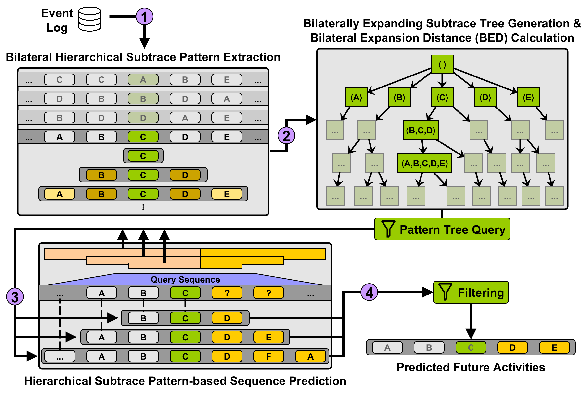

# Hierarchical Structuring of Bilaterally Expanding Subtrace Patterns for Efficient Tree-based Activity Suffix Prediction

This is the implementation accompanying the publication 'Hierarchical Structuring of Bilaterally Expanding Subtrace Patterns for Efficient Tree-based Activity Suffix Prediction' by Simon Rauch, Christian M. M. Frey, Andrea Maldonado, Daniel Schuster, Gabriel Tavares and Thomas Seidl appearing in the Process Science Journal (Collection: [Best Process Science Conference Papers 2025](https://link.springer.com/collections/fcbfjejcab)). This work is an extension of the paper 'BEST: Bilaterally Expanding Subtrace Tree for Event Sequence Prediction' by Simon Rauch, Christian M. M. Frey, Andrea Maldonado and Thomas Seidl presented at the BPM Conference 2025 in Seville, Spain (Track II: Engineering).

## Framework

We provide a prediction framework to forecast future activities of running business processes. The framework itself builds upon a tree structure of bilaterally expanding subtrace patterns extracted from business process event logs. The method is capable of predicting the next activities and the complete remaining trace of a running process.

## Setup

We implemented our approach as a python module (`best4ppm`) and provided an overall forecasting script to reproduce our experimental results.
To setup the environment for running our code, we provide a `pyproject.toml` file (requires python>3.12) from which the needed dependencies can be gathered with `pip` via (execute from the project directory):

`python -m pip install .`

or with [`poetry`](https://python-poetry.org/) via (execute from the project directory):

`poetry install`

## Usage

The codebase consists of our module `best4ppm` and different scripts using the module for dataset manipulation (`BPI2012_conversions.py`), event log metric extraction (`log_characteristics.py`) and the experiments for the prediction of next activities and remaining traces (`best_prediction.py`) located in the `src/` folder.

We also provide a set of config files, which are populated with the needed setup to reproduce our experimental results (`general_config.yaml`, `model_configs.yaml`, `data_configs.yaml`) in folder `src/best4ppm/configs/`.

### Config

The general config sets the parameters for the main prediction loop. You can specify the datasets you want to analyze (`dataset` either as list of multiple or string of a single dataset), the evaluation strategy (i.e., cross-validation with `cv_folds` > 1 or single split with `cv_folds`==1 alongside the desired 'train_pct' specifying the share of cases you want to use for training) and the model configuration (`model_config`). For multiprocessing you can set the number of cores you want to use for the evaluation (`ncores`).

The general config file specifies the is linked to the remaining config files. With `dataset` you access the different data configurations matched by the dataset name. The data config file specifies the dataset filename (`file_name`) and the relevant column identifiers (`case_identifier`, `activity_identifier`, `timestamp_identifier`).

The model config file holds the model-specific parameters for model training. Our model has different parameters: 

- `max_pattern_size_train`/`max_pattern_size_eval`: specifying the depth of the tree (train) and the maximum traversal depth in the evaluation loop (eval). The depth is specified via the maximum allowed subtrace pattern size where the (pattern size - 1)/2 is the depth of the tree.

- `process_stage_width_percentage`: The main parameter for the number of process stages. The number of process stages is statically determined by calculating the process stage width via the percentage of the maximum trace length we see in the training data. A value of zero results in `n` process stages of width 1 with `n` being the maximum trace length we see in the training data, i.e., n BEST models. A value of 1 results in a single process stage, i.e., one trained BEST model.

- `task`: the tasks you want to perform. `nap` performs Next Activity Prediction and `rtp` performs Remaining Trace Prediction (can also be passed as a list of both tasks).

- `min_freq`: global minimum relative frequency (cutoff probability) for subtrace patterns which is used to provide a pre-pruning mechanism. Patterns with a global relative occurrence frequency lower than the specified value are pruned from the hierarchical tree along with all their decendants. A value close to zero prevents filtering of subtrace patterns. We set this to 10e-15 in our main experiments.

- `break_buffer`: the predicted sequence length at which the prediction loop is terminated in terms of `break_buffer` times the maximum trace length we see in the training dataset. We set this to 1.2 in our experiments.

- `prune_func`: A prune function for tree post-pruning. This is not applied/implemented currently. We rather opted for pre-pruning via the `min_freq` parameter.

- `filter_sequences`: this filters the padded dummy activity tokens from the predicted sequences for evaluation. Should be set to `True` for a sound evaluation of predictive performance.

- `selection_method`: the selection strategy used withing the prediction loop. We added different selection strategies for the extended version of our paper, the two relevant ones being `PROB_LEN_DIST` (strategy used in the original BPM 2025 contribution filtering for 1. minimum local BED (highest local conditional pattern extension probability), 2. longest patterns, 3. minimum global BED) and `WEIGHTED_PROBS_LEN` (weighted selection strategy that selects the longest patterns from those with the highest weighted conditional pattern extension probability).

- `weights`: the `weight` values used within strategy `WEIGHTED_PROBS_LEN` (between 0 and 1).

### Sequence Prediction with BEST

We provide script for complete recreation of the experiments presented in the paper. The script performs the model training for the given parameters in the config files and subsequently performs Next Activity Prediction and Remaining Trace Prediction for the test instances including the evaluation by accuracy and similarity metrics. We recommend to alter the model configuration in the `model_configs.yaml` or to use model configuration `test_config` for testing of the pipeline as the full experimental evaluation performs training and predictions for an exhaustive set of parameter combinations.

After a correct setup of the environment, execution of `best_predictions.py` executes the complete training, prediction and evaluation pipeline:

`python src/best_predictions.py`

In the current configuration the following pipeline is performed:

- Generation of 5 folds of training and test data for the 5-fold cross validation experimental setting
- For the different values for parameter `process_stage_width_percentage` in the model configuration, a model training loop is performed for each fold with `max_pattern_size_train` of 21 resulting in a tree with patterns of length 21, i.e., 10 preceding activities, the center activity and 10 suceeding activities
- Predictions are generated for each parameter value given for parameters `max_pattern_size_eval`, `weight` (specified via `weights` if selection strategy is `WEIGHTED_PROBS_LEN`) and for each fold
- The total number of prediction/evaluation runs is specified by `|weights|*|max_pattern_size_eval|*|process_stage_width_percentage|*|cv_folds|`
- The average accuracy/similarity can be calculated by averaging the achieved performance metrics across all folds for one combination of `max_pattern_size_eval`, `weight` and `process_stage_width_percentage`

## Experimental Results

We provide experimental results of our approach within the `results` folder. Metrics of the original contribution are given in `original_runs.csv`/`original_runs_avg.csv` (with strategy `PROB_LEN_DIST`). Results for the weighted probability metric (strategy `WEIGHTED_PROBS_LEN`) are given in `weighted_runs.csv`/`weighted_runs_avg.csv` and results for pruned hierarchical tree with pre-pruning under different values of `min_freq` are attached in `pruning_runs.csv`/`pruning_runs_avg.csv`. We also provide the results achieved on holdout data samples (5-fold cross-validation on 64% of available trace data for training, validation on 16% and final evaluation on the remaining 20% with a refitted model on the complete 80% training dataset) in `holdout_runs.csv`.

## Included Event Log Datasets

- We provide the analyzed datasets in the `data/` folder:
	- `Helpdesk.csv` [[D1]](#D1)
	- `BPI2012.csv` [[D2]](#D2) 
	- `BPI2013_closed.csv` [[D3]](#D3)
	- `BPI2013_incidents.csv` [[D4]](#D4)
	- `env_permit.csv` [[D5]](#D5)
	- `sepsis.csv` [[D6]](#D6)
	- `nasa.csv` [[D7]](#D7)
	- `BPI2017.csv` [[D8]](#D8)
	- `BPI2019.csv` [[D9]](#D9)
- Additionally, we added a script for data manipulation of the BPI Challenge 2012 / BPI Challenge 2017 event logs (`/src/BPI_conversions.py`). Additional event logs are created for analysis:
	- `BPI2012_Full.csv`: BPI Challenge 2012 with an augmented activity identifier consisting of the raw activity names and the lifecycle information (SCHEDULE, START, COMPLETE)
	- `BPI2012_W.csv`: A subset of the `BPI2012_Full.csv` where we only consider the workflow information, i.e., activities with the `W_` prefix
	- `BPI2012_C.csv`: A subset of the `BPI2012.csv` where we only consider the activities with `COMPLETE` lifecycle information
	- `BPI2012_WC.csv`: A subset of the `BPI2012_C.csv` where we only consider the workflow information, i.e., activities with the `W_` prefix
	- `BPI2017_Full.csv`: BPI Challenge 2017 with an augmented activity identifier consisting of the raw activity names and the lifecycle information (SCHEDULE, START, COMPLETE)

## Dataset References

<a id="D1">[D1]</a> Polato, Mirko (2017). Dataset belonging to the help desk log of an Italian Company (Link: <https://data.4tu.nl/articles/_/12675977/1>)

<a id="D2">[D2]</a> van Dongen,  Boudewijn (2012). BPI Challenge 2012 (Link: <https://data.4tu.nl/articles/_/12689204/1>)

<a id="D3">[D3]</a> Steeman, Ward (2013). BPI Challenge 2013, closed problems (Link: <https://data.4tu.nl/articles/_/12714476/1>)

<a id="D4">[D4]</a> Steeman, Ward (2013). BPI Challenge 2013, incidents  (Link: <https://data.4tu.nl/articles/_/12693914/1>)

<a id="D5">[D5]</a> Buijs, Joos (2022). Receipt phase of an environmental permit application process (WABO),  CoSeLoG project (Link: <https://data.4tu.nl/articles/_/12709127/2>)

<a id="D6">[D6]</a> Mannhardt,  Felix (2016). Sepsis Cases - Event Log (Link: <https://data.4tu.nl/articles/_/12707639/1>)

<a id="D7">[D7]</a> Leemans,  Maikel (2017). NASA Crew Exploration Vehicle (CEV) Software Event Log (Link: <https://data.4tu.nl/articles/_/12696995/1>)

<a id="D8">[D8]</a> van Dongen,  Boudewijn (2017). BPI Challenge 2017 (Link: <https://data.4tu.nl/articles/_/12696884/1>)

<a id="D9">[D9]</a> van Dongen,  Boudewijn (2019). BPI Challenge 2019 (Link: <https://data.4tu.nl/articles/_/12715853/1>)
